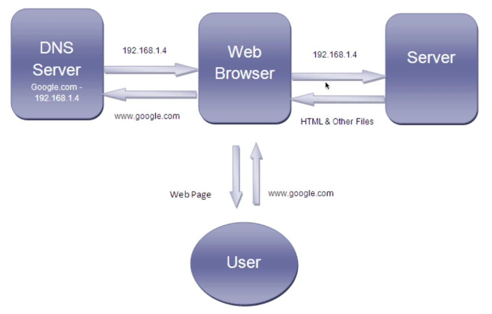

# Web

## The Internet

- A global network of computers
- Each computer/router has a **IP address**
- Computers talk to eachother using the **TCP/IP** protocol
- **HTTP** handles web traffic (requests/responses)

Hypertext transfer protocol HTTP
Hypertext transfer protocol secure HTTPS

## Web Servers

- **Websites/Webpages** are files stored on computers that run a
piece of software called a **web server** (Apache, Nginx, etc.)
- **Hosting Companies** provide space on a server for your website
- **Domain names** can be purchased from registrars and linkes to
your hosting account/web server
- **DNS** is used to map IP addresses to domain names

