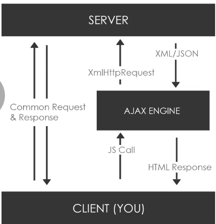

# Asynchrononous Javascript, Ajax & Fetch API

## 1. Synchronous Code
Blocks the `doTheNextThing()` until posts are loaded. Slow!

```javascript
Posts = loadPostSync()
// ... wait til posts are fetched
// ... do something with posts

// Has to wait until posts load
doTheNextThing();
```

## 2. Asynchronous Code

Code is not blocked. While the posts are still loading, the `doTheNextThing()` can still do something.

```javascript
loadPostsAsync(function () {
  // ... wait til posts are fetched
  // ... do something with posts
})

// Doesn't have to wait until posts load
doTheNextThing(); 
```

### 2.1. Browser/Server APIs

Most Async code will be part of an API or library.

- XMLHttpRequest & Fetch
- jQuery Ajax, Axios, other HTTP Libraries
- Node.js fs(filesystem) module

### 2.2. Handlng Async Code

There are a few ways to work with Async doe

- Callbacks
- Promises
- Async/Await


## 3. What is AJAX?

- Asnychronous JavaScript & XML
- Set of web technologies
- Send & Receive data asynchronously
- Does not interfere with the current page
- JSON has replaced XML for the most part



Instead of a Common Request & Response (HTTP Requests -> loads the full page) we can update and refresh small parts of a page with AJAX.

- Make async requests in the background
- No page reload/refresh
- Fetch data
- Very interactive

### 3.1. XmlHttpRequest (XHR-Object)

- API in the form of an object
- Provided by the browsers JS environment
- Methods transfer data between client / server
- Can be used with other protocols than HTTP
- Can work with data other than XML (JSON, plain text)

### 3.2. Libraries & Other Methods

- Fetch API (recommended, vanilla JS)
- Axios
- Superagent
- jQuery (DOM-Manipulation, not recommended)
- Node HTTP (nice if you use node.js)

## 4. What is an API?

**Application Programming Interface**

- Contract provided by one piece of software to another
- Structured request and response
- We just worked with an API that takes a request and response with jokes

### 4.1. Rest API

**Representational State Transfer**

API is the messenger, REST let's us use a HTTP-Request to format that message. Takes multiple types of requests, like the ('GET')

- Architecture style for designing networked applications
- Relies on a stateless, client-server protocol, almost always HTTP
- Treats server objects as resources that can be created or destroyed (Server-Object, like a Blogpost, User, usually stored in database) We can create (Post-Request), delete with the (Delete-Request)
- Can be used by virtually any programming language
- All APIs have their own rules and structure

### 4.2 HTTP Requests

- GET: Retrieve data from a specified resource (.txt-file data, .json-file data, or web data)
- POST: Submit data to be processed to a specified resource (add a post to a db, add a user)
- PUT: Update a specified resource (already on a server)
- DELETE: Delete a specified resource (delte smth already on the server)

Minor Requests

- HEAD: Same as get but does not return a body
- OPTIONS: Return the supported HTTP methods
- PATCH: Update partial resources

### 4.3 API Endpoints

- GET   https://someurl.com/api/users // Get all users
- GET   https://someurl.com/api/users/1 // Get single user
- POST   https://someurl.com/api/users // Add user
- PUT   https://someurl.com/api/users/1 // Update user
- DELETE   https://someurl.com/api/users/1 // Delete user

## 5. async, await vs .then()

```javascript
// Using then
doSomething(payload) {
  const url = 'https://link-here/consultas';
  return this.axios.get(url, {
    params: {
      token: payload.token,
      chave: payload.chave,
    },
   }).then(resp => resp.data);
}

// Using Async / await
async doSomething(payload) {
   const url = 'https://link-here/consultas';
   const resp = await this.axios.get(url, {
   params: {
     token: payload.token,
     chave: payload.chave,
    },
 });
 return resp.data;
}
```