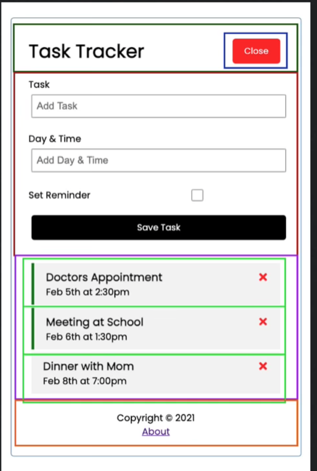
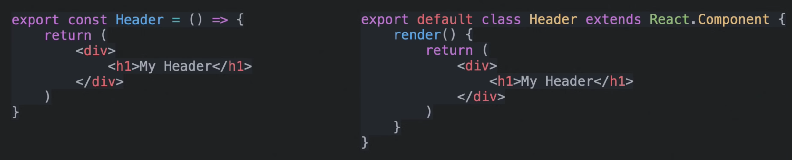
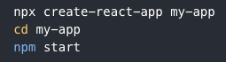

# What is React?

## React is a library for building user interfaces

React runs on the client as a SPA (Single Page Application), but can be used to build full stack apps by communicating with a server/API (eg. MERN stack)

React is often referred to as a front-end "framework" because it is capable and directly comparable to a framework such as Angular or Vue.

## Why would you use React?

- Structure the "view" layer of you application (view is what the user sees, UI)
- Reusable components with their own state
- JSX - Dynamic markup (JavaScript Syntax Extension, HTML and CSS inside JavaScript)
- Interactive UIs with Virtual DOM
- Performance & testing
- Very popular in the industry

## What should you know first?

You shoueld have a good handle on JavaScript. Learn JavaScript first.

- Data types, variables, functions, loops, etc.
- Promises & Asynchronous Programming
- Array methods: forEach, map
- Fetch API, HTTP Requests

## UI Components

When using React, think of UI as a bunch of seperate components



## Components: Function vs. Classes



Components render/return JSX (JavaScript Syntax Extension)

Components can also tak in "props"

```
<Header title="My Title"/>
```

## Working with state

Component can have "state" which is an object that determines how a component renders and behaves.
(e.g. an menu can have a open or a closed state -> True or False)
Any data you bring in can have a state.

"App" or "global" state refers to state that is available to the entire UI, not just a single component.

Prior to React 16.8, we had to use class based components to use state. Now we can use functional components with *hooks*.

## React Hooks

**React Hooks** are functions that let us **hook** into the **React** state and lifecycle feature from function components.

- useState -> Returns a stateful value and a function to update it
- useEffect -> Perform side effects in function components
- useContect, useReduces, useRef -> Beyond this course!

You can create your own custom hooks.


## Commands


## Use Icons

`npm i react-icons`

## Production Build

This will create `build`-folder. This is what we actually need to deploy.

`npm run build`

HTTP Server

`sudo npm i -g serve`
`password:`

`server -s build -p 8000`

Host on `http://localhost:8000`

## JSON Server

Mock Rest API

Install locally, will only be installed in the package.json file of this current project
`npm i json-server`

Globally
`npm i -g json-server`

Add

`"server": "json-server --watch db.json --port 5000"`
in the package.json-file.

``` 
  "scripts": {
    "start": "react-scripts start",
    "build": "react-scripts build",
    "test": "react-scripts test",
    "eject": "react-scripts eject",
    "server": "json-server --watch db.json --port 5000"
  },
```

So this will run the server, we can pretend its a real server.

To run the server:

`npm run server`


For development, you may want to run the app too. Open another terminal and run the app

`npm start`

So we have to server running:

- JSON Server for our "backend database"
- React Dev Server for our application 

## Routing

react-routing-dom

`npm i react-router-dom`